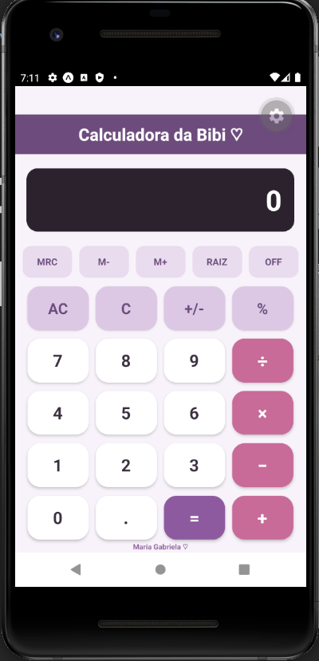

# 🧮 Calculadora React Native

Calculadora simples desenvolvida em **React Native com Expo** para a matéria de **Desenvolvimento Mobile**.

O projeto foi criado com o objetivo de praticar conceitos iniciais de desenvolvimento de interfaces mobile utilizando componentes e estilização no React Native.

## 💜 Tecnologias

* React Native
* Expo
* JavaScript

## 📱 Interface

A calculadora possui uma interface personalizada com:

* Botões numéricos
* Operadores matemáticos
* Visor da calculadora
* Funções auxiliares
* Layout desenvolvido com `StyleSheet`

### 📱 Versão 01

  

---

